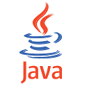

= Fundamentos básicos, teorias e aplicação computacional
:author:    Eduardo de Santana Medeiros Alexandre
:backend:   slidy
:lang: pt-BR

== Antes de Falar sobre Java

* Como os programas são criados e executados?

== Como os programas são criados e executados

Como os programas são criados a partir das linguagens de programação:

["graphviz", "programa.png"]
----
digraph automata_0 {
  rankdir=LR;
  node [shape = box];
  Analista[label="Programador/Analista", fillcolor=tomato, style=filled]
  Codigo[label="Código fonte", fillcolor=purple, style=filled]
  Programa[label="Programa", fillcolor=gold, style=filled]
  Plataforma[label="Plataforma", fillcolor=palegreen, style=filled]

  Analista->Codigo[label="Escreve o programa"];
  Codigo->Programa[label="Compila o código"];
  Programa->Plataforma[label="Executado em"];
  {rank=same; Plataforma Codigo}
}
----

.Plataformas famosas
- Windows
- Linux
- OSx
- Android

== O que é Java?

- Java é uma das _linguagens_ de desenvolvimento de sistemas mais utilizadas no setor de informática

- Java (através da sua máquina virtual) também é uma _plataforma_

.Plataformas famosas
- Windows
- Linux
- OSx
- _Máquina Virtual Java_
- Android

== Quais as características mais marcantes do Java?

* Máquina Virtual

image::jvm.png[]

== Outra características marcante do Java

Orientação a Objeto:: é um "estilo" de como os códigos são escritos.

NOTE: Existem outras linguagens, além do Java, que permitem a escrita dos programas nesse "estilo" (Orientação a Objeto).

IMPORTANT: Memorize este termo: *Orientação a Objeto*. Embora ele não seja abordado nesta aula, será estudado ao longo do curso.

== Onde usar e os objetivos do Java

* O foco do Java são as _aplicações de médio a grande porte_, onde o time de desenvolvedores tem várias pessoas e sempre pode vir a mudar e crescer.

* Criar a primeira versão de uma aplicação usando Java, mesmo utilizando IDEs (ambientes de programação) e ferramentas poderosas, será mais trabalhoso que muitas linguagens script ou de alta produtividade.

* Porém, com uma linguagem orientada a objetos e madura como o Java, _será extremamente mais fácil e rápido fazer alterações no sistema, desde que você siga as boas práticas_.

* _Quantidade enorme de bibliotecas gratuitas para realizar os mais diversos trabalhos_ (relatórios, gráficos, sistemas de busca, geração de código de barra, manipulação de XML, tocadores de vídeo, manipuladores de texto, persistência transparente, impressão, etc)

== Quando optar por escrever um programa em Java?

* O uso do Java é interessante em aplicações que _virão a crescer_, em que a _legibilidade do código é importante_, onde temos muita conectividade e se há _muitas plataformas_ (ambientes e sistemas operacionais) heterogêneas (Linux, Unix, OSX e Windows).

== Aplicações famosas feitas em Java

.Aplicação WEB
image::banco_do_brasil_java.png[]

== Aplicações famosas feitas em Java

Todos os brasileiros podem utilizar o Programa, independente do sistema operacional que possuir.

.Aplicação Desktop
image::irpf2014-1.jpg[]

== Aplicações famosas feitas em Java

NOTE: Os programs feitos para Android utilizam Java.

.Aplicações para celular
image::java-for-android.png[]

== Prática

* Demonstração da utilização da Linguagem Java

=== Vamos precisar/utilizar

* Eclipse (Ambiente de Desenvolvimento)
* Conceito de _Coleção_
* Conceito de _String_: sequência de caracteres

== Questionário de Revisão

* Java é uma Linguagem ou uma Plataforma?
* Quais as duas características mais marcantes do Java?
* Quando optar por escrever um programa em Java?
* Qual a importância dos critérios de avaliação da História?

// compensação da ausência às aulas - incapacidade física relativa
